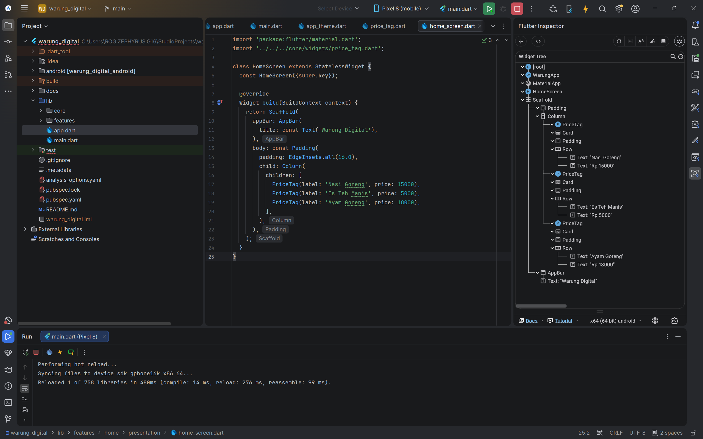

Flutter menerapkan Single Responsibility Principle dengan memisahkan tanggung jawab tata letak 
dan pembuatan konten visual ke dalam widgetnya masing-masing. 
Widget Text hanya bertugas mengatur konten string dan gaya tipografinya,
sedangkan Center bertugas khusus menangani posisi child di dalam ruang yang tersedia.
pemisahan ini dapat membuat widget dapat digunakan kembali secara fleksibel

